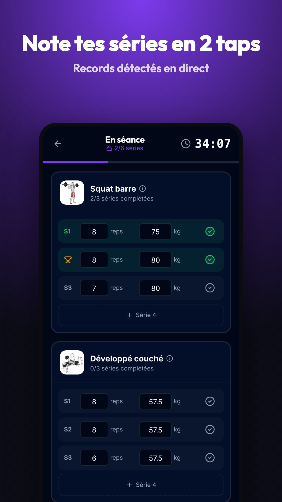
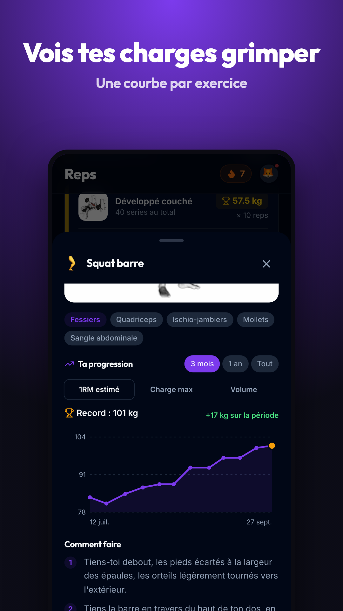
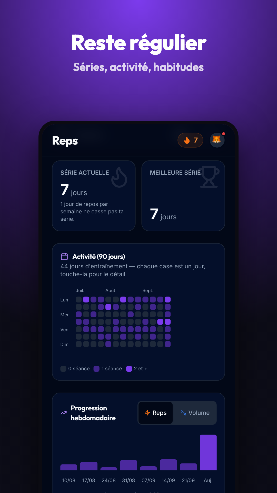

# 🏋️ REPS — ton carnet d'entraînement

> Le carnet d'entraînement **gratuit et en français**, pour la muscu **et** le poids du corps —
> motivé par tes amis. Application web (PWA) et Android (Capacitor), iOS prévu.

[](https://github.com/PierrePocheron/reps/actions/workflows/ci.yml)

**Web** : https://pedro-reps.web.app · **Android** : [dernière version](https://github.com/PierrePocheron/reps/releases/latest)

| | | | |
|:---:|:---:|:---:|:---:|
|  |  |  |  |

---

## Fonctionnalités

**Séance muscu**
- Saisie rapide : valeurs de la dernière fois, rappel « Précédent » quand on s'en écarte, suggestion de surcharge progressive
- Types de séries (échauffement, dégressive, échec), RPE, notes, supersets, exercices en durée avec chrono
- Réordonner / remplacer un exercice, titre et note de séance, séance oubliée saisie à sa vraie date
- Minuteur de repos automatique (notification écran verrouillé, durée par exercice, ±15 s), écran maintenu allumé
- Records en direct (charge et durée) avec célébration, écran de récap, partage en image
- Calculateurs de disques et de séries d'échauffement

**Séance renfo** : compteur de répétitions en direct, calories estimées, modèles, récap.

**Progrès** : courbe par exercice (1RM estimé, charge, volume, durée), dernières séances détaillées, records,
répartition musculaire, statistiques et habitudes, récap mensuel / annuel partageable, mensurations et poids de corps.

**Historique** : modifier, supprimer, filtrer par exercice ; export CSV (format Strong) et **import Strong / Hevy**.

**Motivation & social** : série quotidienne (avec joker) ou hebdomadaire, objectif hebdo, questionnaire de départ,
badges, défis, amis, fil d'activité, classement, widget Android.

**Hors ligne** : séance terminée, modifiée ou supprimée, modèles, mensurations et réglages enregistrés sans réseau
(salle en sous-sol), envoyés au retour de la connexion.

**Accessibilité** : contraste AA (clair et sombre), écrans dès 320 px, lecteurs d'écran.

---

## Stack

| Couche | Outils |
|---|---|
| Front | React 18, TypeScript, Vite, Tailwind CSS, shadcn/ui (Radix), Zustand, Framer Motion (pages secondaires) |
| Mobile | Capacitor 8 (Android, iOS) — notifications locales, partage, fichiers, haptique, AdMob, connexion Google native, plugins locaux (widget, écran allumé) |
| Back | Firebase : Authentication, Firestore (règles testées), Hosting, App Check |
| Qualité | Vitest, tests de règles Firestore, e2e Playwright, audit de contraste, ESLint, SonarCloud, Sentry |

---

## Démarrer

```bash
yarn install
yarn dev:demo     # démo complète hors ligne : émulateurs Firebase + données fictives → http://localhost:5199
```

Avec un vrai projet Firebase : `cp .env.example .env`, remplir les clés ([ENV.md](ENV.md)), puis `yarn dev`.

### Commandes utiles

| Commande | Rôle |
|---|---|
| `yarn dev` / `yarn dev:demo` | Serveur de dev (vrai projet / démo sur émulateurs) |
| `yarn build` | Build de production (`dist/`) |
| `yarn type-check` · `yarn lint` | Types · lint (0 avertissement exigé, aussi en CI) |
| `yarn vitest run` | Tests unitaires et composants |
| `yarn test:rules` | Règles Firestore sur l'émulateur |
| `yarn e2e` · `yarn a11y` | Parcours de bout en bout · audit de contraste (démo lancée) |
| `yarn store:screenshots` | Captures Play Store (`store/fr-FR/screenshots/`) |
| `yarn cap:sync` · `yarn cap:open:android` | Synchroniser / ouvrir le projet natif |

---

## Branches, versions, déploiement

`dev` (travail quotidien) → `main` (PR) → `prod` (releases taguées X.Y.Z, déploiement web automatique).

- Releases : [docs/RELEASE.md](docs/RELEASE.md)
- **Déploiements et prérequis stores** (web, règles Firestore, Play Store, App Store) : [docs/DEPLOY.md](docs/DEPLOY.md)

---

## Documentation

| Document | Contenu |
|---|---|
| [CHANGELOG.md](CHANGELOG.md) | Changements par version, et ceux en attente de release (« Non publié ») |
| [ENV.md](ENV.md) | Variables d'environnement, fichiers natifs, secrets CI |
| [docs/DEPLOY.md](docs/DEPLOY.md) | Procédures de déploiement, checklists Play Store / App Store |
| [docs/RELEASE.md](docs/RELEASE.md) | Branches, versionnage, publication d'une version |
| [docs/TESTS.md](docs/TESTS.md) | Tests unitaires, règles, e2e, accessibilité, démo Android |
| [docs/TOOLS.md](docs/TOOLS.md) | Outils du projet et commandes |
| [docs/PLAYSTORE.md](docs/PLAYSTORE.md) | Fiche Play Store, Data Safety, captures |
| [docs/COMPETITIVE.md](docs/COMPETITIVE.md) | Analyse concurrentielle (Hevy, Strong…) et écarts restants |
| [docs/LOOP.md](docs/LOOP.md) | Boucle d'amélioration continue et son journal |
| [docs/WEBSITE.md](docs/WEBSITE.md) | Réflexion sur le site vitrine |

---

## Règles du dépôt

Dépôt **public** : aucune donnée personnelle (noms réels, identité de l'éditeur, clés) dans le code, les tests
ou les commits — l'identité vit dans `.env` et les secrets GitHub. Les fichiers Firebase natifs
(`google-services.json`, `GoogleService-Info.plist`) et la keystore ne sont pas versionnés.
